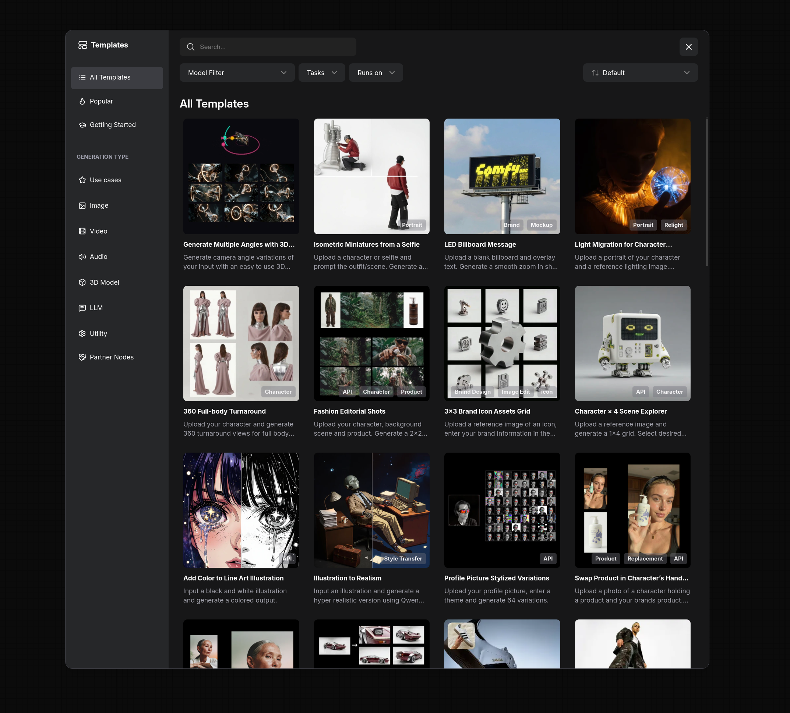
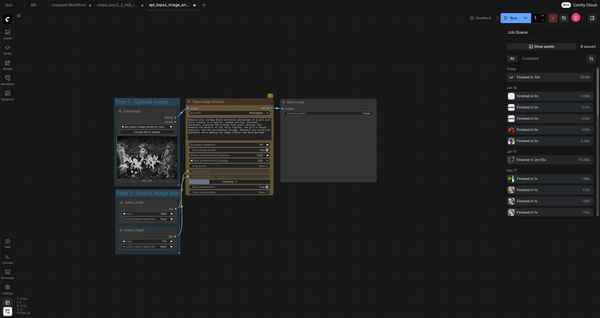
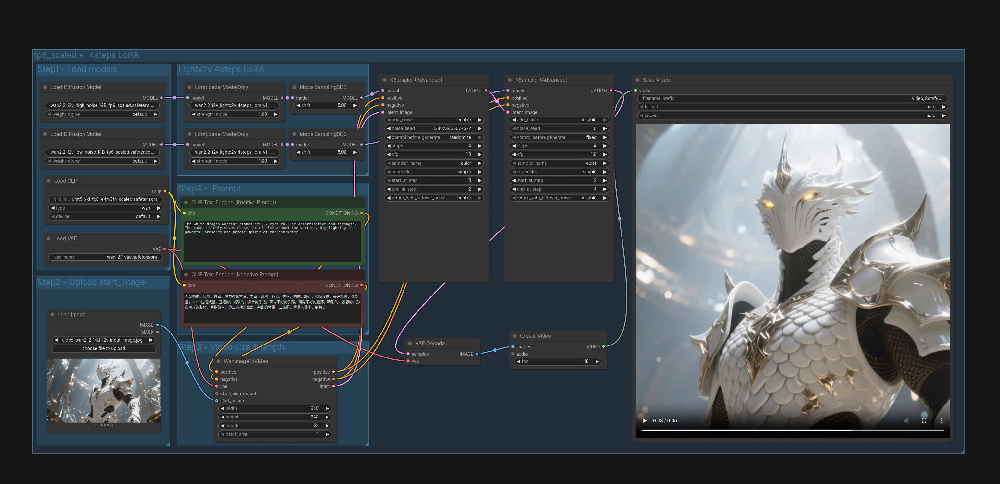
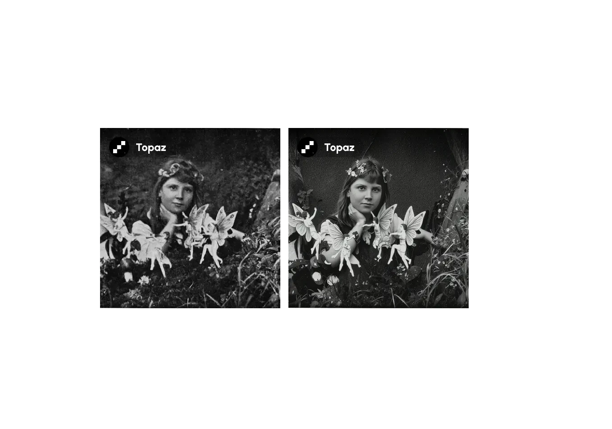
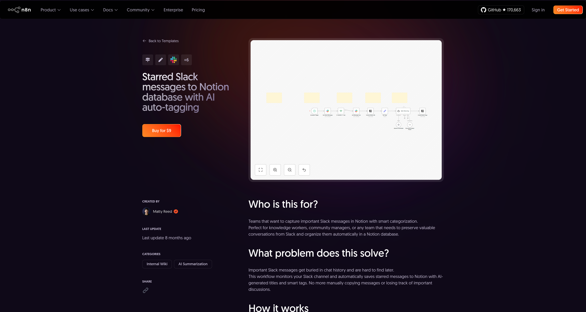

# ComfyUI Template Page — Design Brief

## Project Overview

We need Figma mockups for a landing page that showcases AI-powered creative tools.

{ width=100% }

---

## What is ComfyUI?

[ComfyUI](https://github.com/Comfy-Org/ComfyUI) is a popular open-source application for creating AI-generated images, videos, and audio. Users build custom AI pipelines by connecting visual "nodes" (like building blocks in a flowchart). It has **101k+ GitHub stars** and is used across creative industries worldwide.

**You don't need to understand how it works** — just know we need pages that showcase what it can do.

{ width=100% }

---

## Key Terms Explained

### What is a "Workflow"?

A **workflow** is a saved configuration of connected nodes that performs a specific task. Think of it like a recipe — once someone creates a workflow that does something useful (like upscaling images), others can download and use it.

{ width=100% }

### What is a "Template"?

A **template** is a pre-made workflow we've packaged for easy use. Instead of building from scratch, users pick a template and start creating immediately.

{ width=100% }

---

## What We're Building

Standalone web pages that showcase each template:

1. **Show** what the template does (with example images/videos)
2. **Explain** how to use it (simple steps)
3. **Invite** visitors to try it on our [cloud platform](https://cloud.comfy.org)

**Think of it like:** A landing page for each "recipe" — showing the finished dish and inviting people to cook it themselves.

**SEO Goal:** These pages are designed to rank in search results for queries like "ComfyUI image upscale workflow" or "AI video generation tutorial". The content structure should support discoverability.

**To explore the templates yourself:** Create a free account at [cloud.comfy.org](https://cloud.comfy.org) and browse the templates gallery. You'll see all the different content types, badges, media formats, etc. — this will help you understand how to make the design properly extensible and generic.

---

## Primary Reference

### n8n Workflow Template Page

**Link:** [n8n Slack to Notion Workflow](https://n8n.io/workflows/4502-starred-slack-messages-to-notion-database-with-ai-auto-tagging/)

{ width=100% }

**What we love about this page:**

- **Clear sections**: "Who is this for?", "What problem does this solve?", "How it works", "Setup steps", "Example output"
- **Scannable structure**: Easy to understand at a glance
- **Author attribution**: Shows who created it
- **Category tags**: Quick visual identification
- **Strong CTA**: Clear call-to-action to use the template

**What we'd improve:**

- More visual emphasis on example outputs (ours are images/videos, more visual than automation tools)
- Stronger hero section with prominent imagery
- More modern/creative styling (n8n is fairly utilitarian)

---

## Competitive Landscape

These are search results for "ComfyUI image upscale workflow" — the sites we're competing with:

- [OpenArt Workflows](https://openart.ai/workflows/elim_droflem/latent-upscale-workflow-enhance-your-base-image/tdumeZf39DyTUWNDDIK8)
- [ComfyAI.run Demo](https://comfyai.run/demo/image+upscaler/91c9a0ac-fb29-47f0-80e6-dc2f4f7cf15f)
- [Civitai Article](https://civitai.com/articles/7306/upscale-any-image-with-this-minimal-comfyui-workflow)
- [Next Diffusion Tutorial](https://www.nextdiffusion.ai/tutorials/how-to-upscale-images-with-supir-in-comfyui)

None are particularly well-designed. **We want to be significantly better.**

---

## Page Sections to Design

### 1. Header/Navigation

- Logo linking to [comfy.org](https://www.comfy.org)
- Simple nav (e.g., "Templates", "Try ComfyUI")

### 2. Hero Section

- Template name (e.g., "AI Image Upscaler", "Text to Video Generator")
- Category badge: **Image** (blue) / **Video** (purple) / **Audio** (green) / **3D** (orange)
- Short description (1-2 sentences)
- Primary CTA button: "Try This Template"

### 3. Visual Examples

The heart of the page — showing what the template creates. Outputs vary by template type: static images, animated webp videos, or audio files.

Different templates need different visual treatments:

| Template Type      | Output Format | Visual Display                 |
| ------------------ | ------------- | ------------------------------ |
| Image upscaler     | Static image  | Before/after comparison        |
| Text-to-image      | Static image  | Gallery of outputs             |
| Video generator    | Animated webp | Video player or preview        |
| Audio generator    | Audio file    | Audio player with waveform     |
| Background remover | Static image  | Before/after with transparency |

**Example: Before/after from an image enhancement template:**

{ width=48% }
{ width=48% }

**Example: Frame from a video generation template:**

{ width=60% }

### 4. About Section

- 1-2 paragraphs explaining what it does and why it's useful
- Similar to n8n's "What problem does this solve?"

### 5. How to Use _(optional — some templates have this, some don't)_

- Numbered step-by-step instructions (2-8 steps)
- e.g., "1. Upload your image → 2. Adjust settings → 3. Click Generate"

### 6. Use Cases _(optional)_

- Bullet list of applications
- e.g., "Upscale old family photos", "Enhance product images for e-commerce"

### 7. Technical Details

- AI models used
- Tags/categories
- File size, hardware requirements

### 8. FAQ _(optional — 0-10 items)_

- Collapsible Q&A pairs

### 9. Footer CTA

- Secondary call-to-action
- Links to [docs.comfy.org](https://docs.comfy.org), [GitHub](https://github.com/comfyanonymous/ComfyUI)

---

## The Design Challenge

**This design must work for ANY template.** Content varies significantly:

| Element                 | Minimum  | Maximum |
| ----------------------- | -------- | ------- |
| Example images          | 1        | 5+      |
| Before/after comparison | No       | Yes     |
| How-to steps            | 0 (none) | 8       |
| FAQ items               | 0 (none) | 10      |
| Use cases               | 0 (none) | 8       |

Your design should look polished whether the content is minimal or extensive.

---

## What We'll Provide

### Brand Kit

We'll share our complete brand kit after hiring:

- Logos (various formats)
- Color palette
- Typography/fonts
- Brand guidelines and voice

### Content Examples

- Output images/videos for templates
- Before/after pairs
- Workflow screenshots

---

## Our Sites (for reference)

| Site          | URL                                                                  |
| ------------- | -------------------------------------------------------------------- |
| Main site     | [comfy.org](https://www.comfy.org)                                   |
| Cloud app     | [cloud.comfy.org](https://cloud.comfy.org)                           |
| Documentation | [docs.comfy.org](https://docs.comfy.org)                             |
| About page    | [comfy.org/about](https://www.comfy.org/about)                       |
| GitHub        | [github.com/Comfy-Org/ComfyUI](https://github.com/Comfy-Org/ComfyUI) |

---

## Audience & Tone

**Audience:**

- Digital artists and designers
- Game industry professionals
- VFX, animation, TV, and film studios
- Marketing teams and agencies
- Developers building AI-powered tools

**Tone:**

- Technical but approachable
- Creative and empowering
- Open-source community ethos

---

## Deliverables

### Required

1. **Figma file** containing:
   - Template page — desktop version
   - Template page — mobile version
   - Component library (buttons, badges, image displays, etc.)
   - Key interaction states (hover, active, expanded FAQ)

2. **Content variations** showing:
   - **Minimal**: 1 image, no FAQ, no how-to steps
   - **Full**: 5 images, 8 steps, FAQ section, all optional sections visible

### Nice to Have (not required)

- Dark mode variant
- Micro-interaction/animation notes
- Design rationale documentation

---

## Timeline & Budget

- **Timeline**: 2-3 weeks total (concepts + revisions)
- **Budget**: $800–1,500 USD fixed price

Open to discussing scope adjustments.

---

## About Comfy Org

ComfyUI is open-source and shaped by a community of artists, developers, and dreamers. We believe in giving everyone full control over their creative tools.

**Our Mission:** Build the operating system for generative AI.

We make tools for the artist of the future — a human equipped with AI who can be an order of magnitude more productive. We empower the individual who wasn't born with the gift of the brush to also be a painter.

**What we maintain:**

- [ComfyUI](https://github.com/Comfy-Org/ComfyUI) — the node-based AI engine (101k+ stars)
- [ComfyUI Manager](https://github.com/ltdrdata/ComfyUI-Manager) — extension management
- [Documentation](https://docs.comfy.org) — learning resources

**Who we are:** The original team behind ComfyUI — engineers and artists from Stability AI and Google. Our work is used by millions of users worldwide.

Learn more: [comfy.org/about](https://www.comfy.org/about)

**Contact:** cbyrne@comfy.org or hello@comfy.org

---

## Questions?

Happy to provide:

- Brand kit files
- Sample content and images
- Screen recordings of the current app
- Clarification on any requirements

Reach out anytime at **cbyrne@comfy.org** or **hello@comfy.org**
